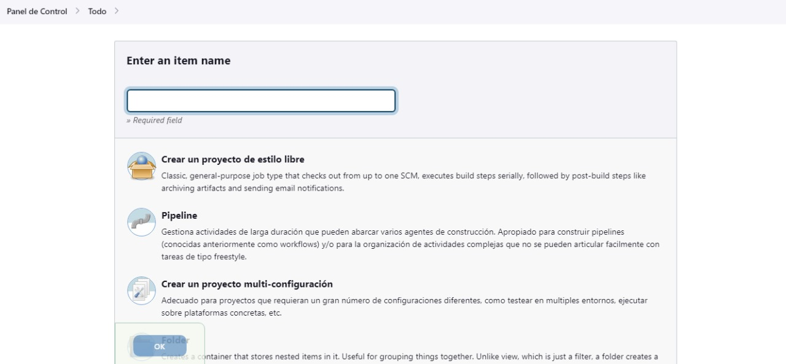
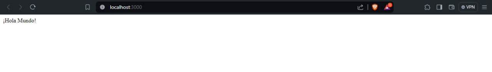

# Jenkins Lab

## yml file
Firts of all, we look up for the docker-compose.yml file and set up the next code:

<br>

I opened the port 3000 cause the node feature uses that port and created a volume for persistency. <br>

After that, I used the ```docker-compuse up -d``` command to deploy the container with docker compose and the ```docker exec id_container cat /var/jenkins_home/secrets/initialAdminPassword``` to get the jenkins key
<br>

Next, I chosed credentials for my jenkins and the url:
<br>
<br>

Then I choose the Nodejs feature for jenkins and hit start jenkins: 
<br>

Now that I had jenkins, I got in the "Administrat Jenkins" field and clicked on tools:
<br>

In tools, I created a "proyecto estilo libre":
<br>

Also added my github repository, Node and npm:
<br>
<br>

Finally I got the proyect in my main page and proceeded to execute it:
<br>
<br>